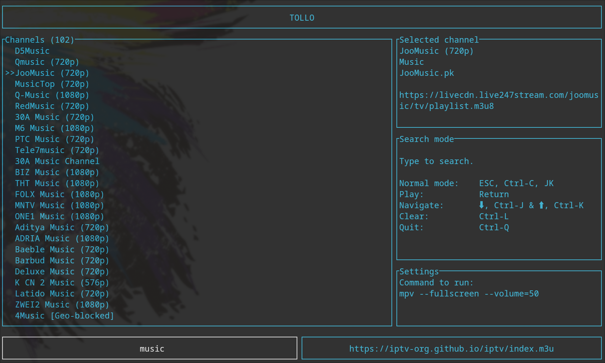

# Tollo

Tollo is an IPTV terminal UI player with fuzzy search written in Rust.



## Features

- Built with [ratatui](https://github.com/ratatui-org/ratatui)
- Fuzzy search for channels by name
- Keyboard shortcuts for easy navigation
- Utilizes `mpv` or a player of your choice for playing the streams
- Defaults to [https://iptv-org.github.io/](https://iptv-org.github.io/)

## Installation

Make sure you have Rust installed. If you don't, you can install it from the [official website](https://www.rust-lang.org/tools/install).

Clone the repository and run the application:

```bash
git clone https://github.com/sambergo/tollo.git
cd tollo
./install.sh
```

## Usage

```bash
tollo [URL]
```

## Configuration

Run `tollo` once to create the default config at `~/.config/tollo/tollo.toml`

```toml
[settings]
player = "mpv"
args = [ "--fullscreen", "--volume=50" ]
m3u_url = "https://iptv-org.github.io/iptv/index.m3u"

```

## Key bindings

| Key                     | Action                    |
| ----------------------- | ------------------------- |
| Normal mode             |                           |
| `q`                     | Quit the application      |
| `/` or `i`              | Switch to search mode     |
| `j` or `down`           | Next channel              |
| `k` or `up`             | Previous channel          |
| `Enter`                 | Play the selected channel |
| `Ctrl+l`                | Clear filter              |
| `Ctrl+f`                | Show favorites            |
| `Shift+f`               | Add / rm favorites        |
| `g`                     | Select the first channel  |
| `G`                     | Select the last channel   |
|                         |                           |
| Search mode             |                           |
| `Enter`                 | Play the selected channel |
| `Ctrl+j` or `down`      | Next channel              |
| `Ctrl+k` or `up`        | Previous channel          |
| `Ctrl+f`                | Show favorites            |
| `Ctrl+l`                | Clear filter              |
| `Ctrl+c`, `Esc` or `jk` | Normal mode               |
| `Ctrl+q`                | Quit the application      |
|                         |                           |

## Dependencies

- mpv or a video player of your choice
- sqlite

## TODO

- [x] Favorites
- [ ] Playlist from path?

## License

[The MIT License](https://opensource.org/licenses/MIT)
