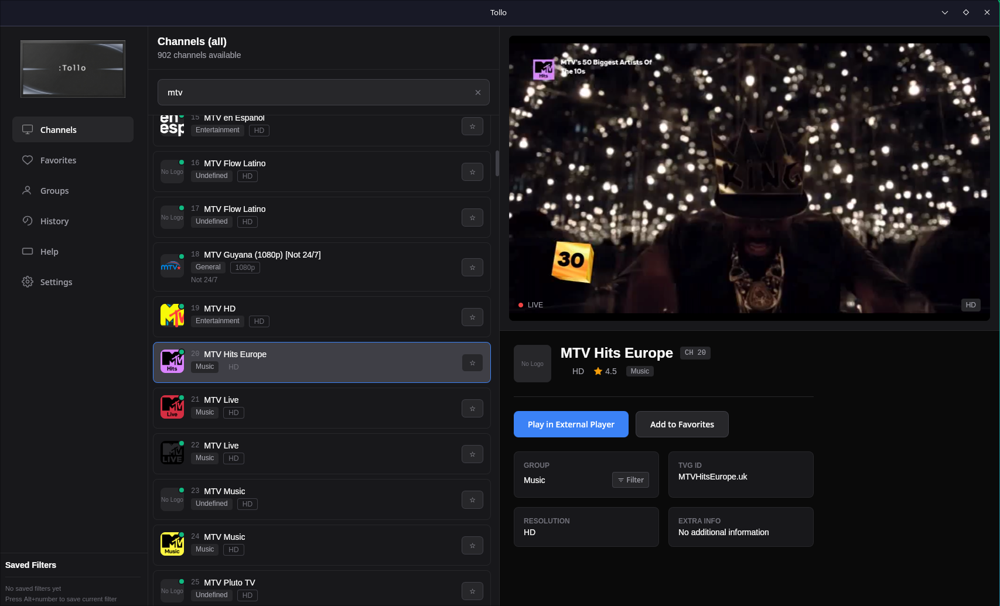

# Tollo - IPTV Player

⚠️ **Development Phase** - This application is currently under active development and may be unstable.

IPTV player with fuzzy search, vim-like navigation, external player integration, favorites and history. Built with Tauri (Rust + React/TypeScript).



## Features

- IPTV playlist management
- Fast fuzzy search
- Vim-like keyboard navigation
- External player integration (MPV)
- Favorites and history
- Portable user-data backup and restore
- Optional browser remote for channels, favourites, and TV playback (Linux host)

## Browser Remote

On a Linux computer connected to your TV, install mpv, open Tollo, and enable
**Settings → Browser Remote → Allow browser remote access**. Scan the QR code
with your phone’s camera, or copy the private
connection link and open it on another computer or phone on the same trusted
local network. Browse playlists, search channels, edit favourites, and control
playback on the TV computer without installing Tollo on the controlling device.

Remote access is off by default. Once enabled, it starts with Tollo and remembers
connected browsers. Turning it off and on keeps the same access key; use
**Revoke access** to change it. Keep Tollo open in the TV desktop session. Access
keys and remote settings stay on the host and are excluded from portable backups. HTTP
connections are unencrypted; use a trusted LAN and keep the private link private.

See the [Browser Remote guide](docs/browser-remote.md) for setup, shared desktop
playback, access revocation, Linux hosting requirements, and troubleshooting.

## Backup & restore

Open Settings → Backup & restore to export a JSON backup or review a backup before importing. Restore replaces settings, channel lists and their default selection, ordered favorites, saved filters, and group selections. Watch history is preserved.

Local playlist contents travel with the backup and restore into Tollo’s data directory. Remote playlists retain their URLs and download again when selected. Downloaded playlists and image caches are excluded. Backups are unencrypted and contain source URLs and configured commands; player and clipboard commands may need adjustment on another operating system.

The version 1 format uses the `tollo-user-data` identifier, an export timestamp, app version, settings, ordered favorites, and channel lists with embedded local content, saved filters, and group selections. Unsupported formats or versions are rejected before any data is replaced.

## Prerequisites

- [Node.js](https://nodejs.org/) (18+)
- [Rust](https://rustlang.org/) (latest stable)
- [pnpm](https://pnpm.io/)
- [MPV player](https://mpv.io/) (for media playback)
- [GStreamer plugins](https://gstreamer.freedesktop.org/) (for video preview: `gstreamer1.0-plugins-bad gstreamer1.0-libav`)

## Installation

Download the latest release for your platform from [GitHub Releases](https://github.com/sambergo/tollo/releases).

### Available Downloads
- **Windows**: `.msi` installer
- **macOS**: `.dmg` disk image *(not tested)*
- **Linux**: `.deb` package and `.AppImage`

## Development

To control playback on another computer connected to a TV, see the
[SSH remote playback prototype](docs/remote-playback.md).

```bash
pnpm install
pnpm dev:tauri
```

## Contributing

This app is ~95% vibecoded, so you might find some weird stuff here and there. Contributions are welcome! Feel free to open issues or submit pull requests.

## License

MIT - see [LICENSE](LICENSE) file.
